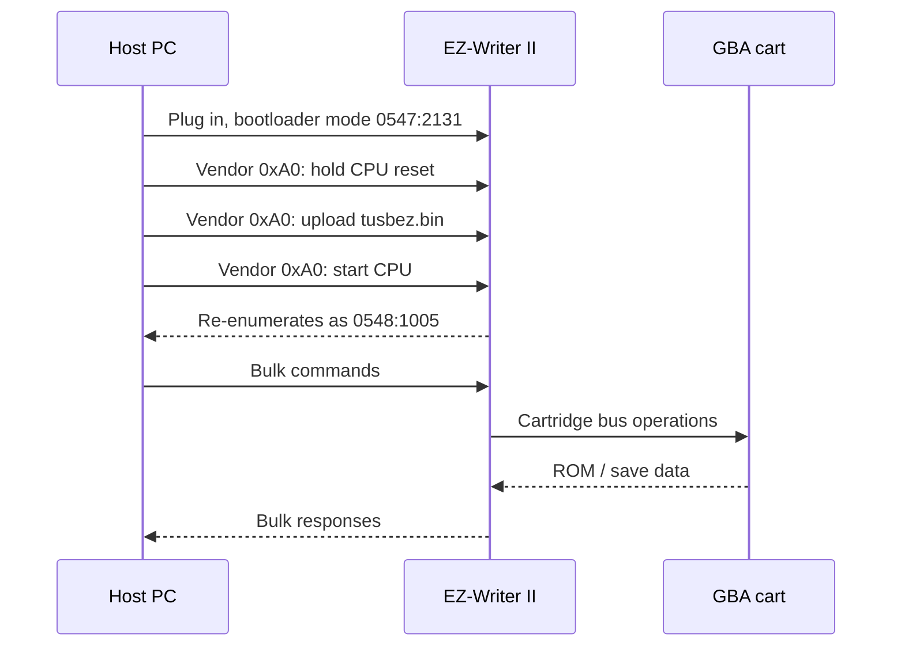

<div align="center">

# EZ-Flash II USB Flasher

Modern open-source tools for the EZ-Writer II / EZ-Flash II USB GBA cartridge flasher.

Dump Game Boy Advance ROMs, back up saves, inspect cartridge headers, and restore saves
from Windows 10/11, Linux, or macOS without the original Windows XP kernel drivers.

**No custom kernel driver. Uses WinUSB + libusb.**

[](LICENSE)
[](https://www.rust-lang.org/)
[]()

</div>

---

## What This Is

The original EZ-Writer II software only works easily on old Windows XP-era setups.
This project replaces the old USB driver path with a Rust CLI and GUI that talk to
the hardware through libusb.

It supports the EZ-Writer II device that starts as `0547:2131` and, after firmware
upload, re-enumerates as `0548:1005`.

## Download

Most people should start here, not with `cargo build`.

1. Go to [Releases](https://github.com/YoshKoz/ez-flash-ii-usb-flasher/releases/latest).
2. Download `ezwriter-gui` for your OS (Windows `.exe`, Linux, or macOS), plus the
   `.bin` firmware files from the same release.
3. Put all downloaded files in the same folder.
4. **Windows only:** install the WinUSB driver with [Zadig](https://zadig.akeo.ie/)
   first — see [Windows driver setup](#windows-driver-setup) below.
5. Run `ezwriter-gui`.

Prefer the command line, or want to build from source? See [CLI Quick Start](#cli-quick-start) below.

## Current Status

| Feature | Status |
|---------|--------|
| Device detection | Working |
| Firmware upload to AN2131 RAM | Working |
| Cartridge header read | Working |
| ROM dump | Working |
| Save read | Working |
| Save write | Working, use backups |
| GUI | Working |
| ROM write / erase | Experimental, high risk |

Read-only actions are the safest and are the intended public release path. Write
features exist for testing and recovery work, but you should back up first and read
[SAFETY.md](SAFETY.md).

## Windows Driver Setup

Windows only — Linux/macOS need no driver (Linux may need a udev rule or root
for USB access; macOS prompts for USB permission).

1. Run [Zadig](https://zadig.akeo.ie/) as Administrator.
2. `Options → List All Devices`.
3. Select `EZ-Writer II` (`0547:2131` or `0548:1005`).
4. Choose `WinUSB`, click `Install Driver`.

The device re-enumerates as a different VID:PID after firmware upload
(`0547:2131` → `0548:1005`), so Windows sees it as a second device. If step 3
still shows an unbound device after firmware load, run Zadig again and bind
WinUSB to the new entry too — it may list under a different name (e.g.
`EZ-Writer Fujitsu`) depending on driver revision, that is expected.

## Troubleshooting

| Symptom | Cause | Fix |
|---|---|---|
| `loader_table1.bin` / `loader_table2.bin` missing | Old release, or files copied from a different driver revision (e.g. `ezloader2.bin`) | Use the exact `.bin` files from [Releases](https://github.com/YoshKoz/ez-flash-ii-usb-flasher/releases/latest) `firmware/`, not files from another tool |
| Device shows unknown in Zadig at `0547:2131` | Expected — that is the bootloader, pre-firmware | Bind WinUSB anyway, run `firmware-download` / open GUI |
| Writer LED stays red, "no cartridge detected" | Cartridge's save backup battery is dead — unrelated to USB/software | Confirm with a cart known to have a good battery; dead battery does not block ROM dump, only save timestamp/backup features |
| WinUSB install seems to do nothing on second run | Bind was already applied to that VID:PID from a prior run | Re-run Zadig, select `List All Devices`, confirm both `0547:2131` and `0548:1005` show WinUSB |
| One cartridge dumps corrupt while another dumps fine | Not the writer — the failing cartridge. Either unstable reads (failing flash, corroded traces, marginal battery) or a bootleg/repro PCB with a non-standard flash chip | Dump twice with `dump --verify`. Mismatches that move between runs = unstable cartridge. Matching-but-wrong output = bootleg/hacked image. Run `save-id` to check the save chip vendor |
| `save-id` reports no change from the baseline read | The save chip did not enter READ ID mode — it is not a JEDEC-compatible flash | Typical of bootleg/reproduction PCBs. Saves from these carts cannot be dumped reliably |
| Save dump refuses with "unrecognised save type" | Game code is not in the built-in catalogue, so the save chip type is unknown | Deliberate: guessing sends a packet that locks the CPLD until you replug. Identify the chip with `save-id`, then use `save-read -t f\|s\|e --output <file>` |

## GUI

The GUI has five tabs:

| Tab | Purpose |
|-----|---------|
| Status | Detect writer and initialize firmware |
| Cart Info | Read title, game code, save type, and ROM size |
| Read ROM | Dump a cartridge ROM to `.gba` |
| Read Save | Dump save data to `.sav` |
| Write Save | Restore save data after backup |

## CLI Quick Start

For scripting, or to build from source instead of using a [Release](#download) binary.

```console
cargo build --release -p ezwriter-cli -p ezwriter-gui
```

`tusbez.bin`, `loader_table1.bin`, and `loader_table2.bin` ship in
[`firmware/`](firmware/) — copy them next to the built executable
(`target/release/`) before running either binary.

```console
cd target/release   # wherever tusbez.bin/loader_table*.bin live

# 1. Detect
./ezwriter-cli list

# 2. Load firmware (if in bootloader mode 0547:2131)
./ezwriter-cli firmware-download tusbez.bin

# 3. Identify cartridge
./ezwriter-cli cart-info

# 4. Dump ROM + save
./ezwriter-cli dump mygame.gba
./ezwriter-cli save-read 0 2048 --output mygame.sav

# 5. If a dump still looks wrong, identify the save chip
./ezwriter-cli save-id

# 6. Measure how fast this hardware can actually dump
./ezwriter-cli bench
```

`dump` sizes the cartridge itself (by finding where the ROM mirrors onto
itself), reads every 64-byte block twice and compares, and only renames
`mygame.gba.partial` to `mygame.gba` once the whole image is complete and
consistent. A dump that cannot be trusted fails with a non-zero exit code
instead of writing a plausible-looking bad file. `--no-confirm` skips the
double read (faster, less safe) and `--verify` adds a further full pass over
the finished image.

Save reads are confirmed and validated the same way: a Gen 3 `.sav` is only
accepted if it is 131072 bytes and carries at least 14 section signatures.

**Speed.** A dump currently costs one USB round trip plus a fixed 5 ms delay per
64-byte chunk, so 16 MB takes roughly 23 minutes (46 with confirmation). The
AN2131 is USB 1.1 full-speed, capping a 16 MB dump at about 14 seconds, so there
is ~100× of headroom. `bench` measures the real per-chunk latency and how much of
it a command queue hides; `dump --pipeline N` then uses that depth. See
[docs/dump_performance.md](docs/dump_performance.md) for the measurements, the
pipelining trade-off, and the batch-read loop that already exists in the
firmware but is never enabled.

(Windows: replace `./ezwriter-cli` with `.\ezwriter-cli.exe`)

`tusbez.bin` is the original 8051 firmware loaded into Cypress AN2131 RAM.
Unplugging resets the chip, so firmware must be uploaded on every connection.

## Safety Rules

- Dump the ROM before writing anything.
- Dump the save before writing anything.
- Use short, reliable USB cables.
- Do not interrupt write operations.
- Treat `write-rom` and `erase` as experimental and high risk.

See [SAFETY.md](SAFETY.md) for the full checklist.

## How It Works


Boot sequence:



Full protocol notes: [docs/protocol_notes.md](docs/protocol_notes.md)

## Project Layout

```text
.
|-- src/ezwriter-cli/       Rust CLI
|-- src/ezwriter-gui/       Rust GUI
|-- firmware/               Vendor AN2131 firmware + loader tables
|-- docs/                   Protocol notes and original driver analysis
|-- driver/winusb-inf/      Optional WinUSB INF files
`-- SAFETY.md               Write-operation safety guide
```

> Originally created as `ezwriter-reverse` during reverse engineering.
> Binaries keep the `ezwriter-` prefix — the hardware is commonly called EZ-Writer II.

## Legal

Use this for homebrew, preservation, personal backups, saves from cartridges you
own, and GBA development. Do not use it for piracy.

## References

- [libusb](https://libusb.info/)
- [WinUSB](https://learn.microsoft.com/en-us/windows-hardware/drivers/usbcon/introduction-to-winusb-for-developers)
- [Zadig](https://zadig.akeo.ie/)
- [egui](https://github.com/emilk/egui)
- [Cypress EZ-USB AN2131 TRM](https://www.infineon.com/assets/row/public/documents/24/44/infineon-an2131-trm-usermanual-en.pdf)
