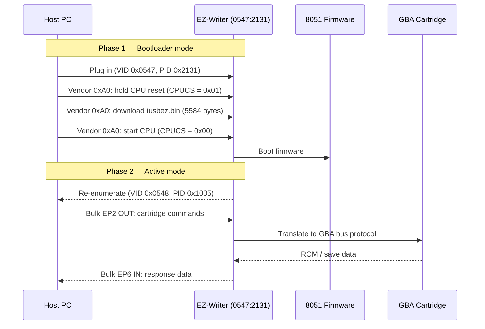

<div align="center">

# EZ-Writer II / EZ-Flash II USB Flasher

Dump GBA ROMs and save files from Game Boy Advance cartridges on modern Windows (10/11), Linux, and macOS.  
Open-source replacement for the Windows XP-era EZ-Writer II (EZ Flash II) USB cartridge reader/writer.  
**No kernel drivers. Just WinUSB + libusb.**

[](LICENSE)
[]()
[](https://www.rust-lang.org/)
[]()

</div>

---

## Quick Start

**1. Install driver** — [Download Zadig](https://zadig.akeo.ie/) → Run as Admin → Options → List All Devices → select `EZ-Writer II` → `WinUSB` → Install Driver.

**2. Build**

```bash
cd src\ezwriter-cli
cargo build --release
```

**3. Dump a cartridge**

```bash
ezwriter-cli firmware-download src\ezwriter-cli\tusbez.bin
ezwriter-cli dump myrom                # → myrom.gba
ezwriter-cli save-read 0 2048 --output myrom.sav
```

`tusbez.bin` is the original 8051 firmware extracted from the EZ-Writer driver. It's uploaded to the Cypress AN2131's RAM at every connect (the chip has no persistent ROM). Included in the repo under [`src/ezwriter-cli/`](src/ezwriter-cli/).

---

## Status

| Feature | Status |
|---------|--------|
| ROM dump | Done |
| Save read | Done |
| Cartridge header parse | Done |
| GUI (egui, 5 tabs) | Done |
| Save write | Done |
| ROM write | Experimental |

---

## GUI

```bash
cd src\ezwriter-gui
cargo build --release
.\target\release\ezwriter-gui.exe
```

Keep `loader_table1.bin` and `loader_table2.bin` next to the `.exe`.

Tabs: Status · Cart Info · Read ROM · Read Save · Write Save

---

## How It Works

### System Architecture


### Boot Sequence



### Data Flow

```
┌──────────────────┐  ┌────────────────────┐  ┌────────────────────┐
│    Your App      │  │  EZ-USB AN2131Q    │  │  EZ-Flash II       │
│  (CLI / GUI)     │  │  8051 firmware     │  │  GBA Cartridge     │
│  libusb + WinUSB │  │  tusbez.bin        │  │  NOR flash + SRAM  │
└──────────────────┘  └────────────────────┘  └────────────────────┘
         │                                         │
         └──────── USB (EP0/EP2/EP6) ──────────────┘
                              │
                        GPIO / parallel bus
                              │
                              ▼
                     Cartridge operations
```

**Why not kernel driver?** Original drivers are unsigned x32-only (won't load on modern Windows) and just wrap USB bulk IOCTLs anyway. WinUSB + libusb does the same thing cleanly.

Full protocol reference: [docs/protocol_notes.md](docs/protocol_notes.md)

<details>
<summary><b>Project structure</b></summary>

```
ezwriter-reverse/
├── analyze_driver.py       ─ Driver binary analysis (root)
├── disasm_ezwinit.py       ─ ezwinit.sys disassembly (root)
├── disasm_full.py          ─ Full firmware disassembly (root)
├── disasm_fwloader.py      ─ Firmware loader disassembly (root)
├── src/ezwriter-cli/      ─ Rust CLI (libusb, clap)
├── src/ezwriter-gui/      ─ Rust GUI (egui/eframe)
├── src/*.py               ─ RE/prototyping scripts (src/)
├── docs/                  ─ Protocol notes, driver analysis
├── driver/winusb-inf/     ─ WinUSB INF + install scripts
├── original/              ─ EZClient v3.26 (reference only)
├── original_backup/       ─ Extracted firmware + drivers
└── captures/              ─ USB packet dumps
```
</details>

---

## Safety

> Write ops can brick your cart if interrupted. Always dump ROM + save first.

| Operation | Risk |
|-----------|------|
| `list`, `info`, `cart-info`, `dump`, `save-read` | Safe (read-only) |
| `firmware-download` | Low (RAM only) |
| `write-save` | Medium |
| `write-rom`, `erase` | **High** — can brick |

See [SAFETY.md](SAFETY.md).

---

## Roadmap

- [x] Device detection, firmware download, ROM dump, save read
- [x] Cartridge header parse, GUI, WinUSB driver
- [x] Save write
- [x] ROM write (experimental — needs protocol confirmation)
- [x] Speed optimization (pipelined reads, `--fast` flag)
- [x] Write Save tab in GUI

---

## Legal

For homebrew, backing up saves from carts you own, and GBA development. **Not for piracy.**

---

## References

[Cypress AN2131 / Infineon EZ-USB FX2LP](https://www.infineon.com/cms/en/product/usb-solutions/ez-usb-fx2lp/) ·
[libusb](https://libusb.info/) ·
[WinUSB](https://learn.microsoft.com/en-us/windows-hardware/drivers/usbcon/introduction-to-winusb-for-developers) ·
[Zadig](https://zadig.akeo.ie/) ·
[egui](https://github.com/emilk/egui)
