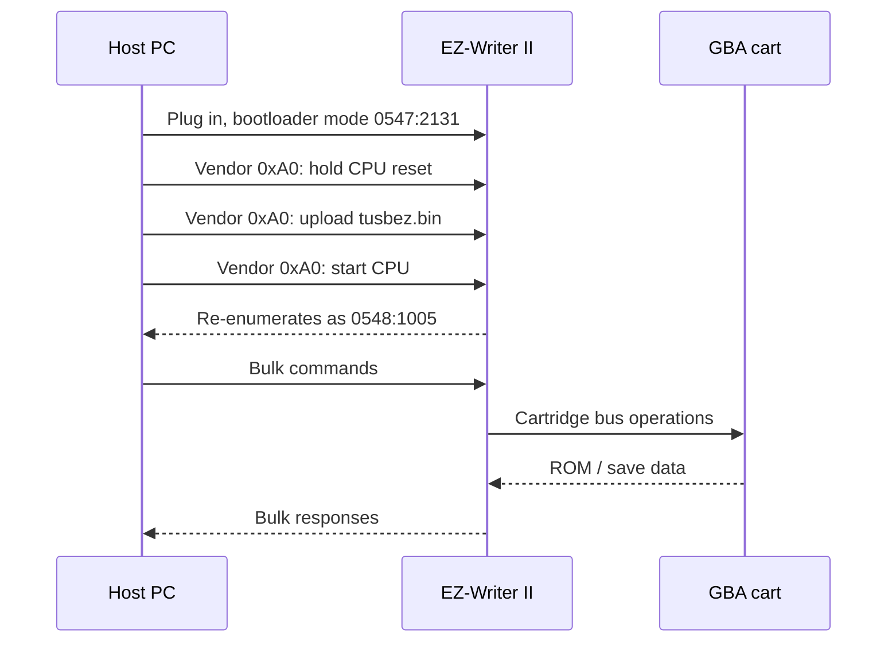

<div align="center">

# EZ-Flash II USB Flasher

Modern open-source tools for the EZ-Writer II / EZ-Flash II USB GBA cartridge flasher.

Dump Game Boy Advance ROMs, back up saves, inspect cartridge headers, and restore saves
from Windows 10/11, Linux, or macOS without the original Windows XP kernel drivers.

**No custom kernel driver. Uses WinUSB + libusb.**

[](LICENSE)
[](https://www.rust-lang.org/)
[]()

</div>

---

## What This Is

The original EZ-Writer II software only works easily on old Windows XP-era setups.
This project replaces the old USB driver path with a Rust CLI and GUI that talk to
the hardware through libusb.

It supports the EZ-Writer II device that starts as `0547:2131` and, after firmware
upload, re-enumerates as `0548:1005`.

## Current Status

| Feature | Status |
|---------|--------|
| Device detection | Working |
| Firmware upload to AN2131 RAM | Working |
| Cartridge header read | Working |
| ROM dump | Working |
| Save read | Working |
| Save write | Working, use backups |
| GUI | Working |
| ROM write / erase | Experimental, high risk |

Read-only actions are the safest and are the intended public release path. Write
features exist for testing and recovery work, but you should back up first and read
[SAFETY.md](SAFETY.md).

## Quick Start

### 1. Install Rust

Install Rust from <https://rustup.rs/> if `cargo` is not already available.

### 2. Install the USB Driver

On Windows:

1. Download Zadig from <https://zadig.akeo.ie/>.
2. Run Zadig as Administrator.
3. Open `Options -> List All Devices`.
4. Select `EZ-Writer II` or the matching `0547:2131` / `0548:1005` device.
5. Select `WinUSB`.
6. Click `Install Driver`.

Linux users may need a udev rule or root permissions for direct USB access.
macOS users normally do not need a driver, but the app still needs USB permission.

### 3. Build the CLI

```console
cd src/ezwriter-cli
cargo build --release
```

### 4. Detect the Writer

Linux/macOS:

```console
./target/release/ezwriter-cli list
```

Windows PowerShell:

```console
.\target\release\ezwriter-cli.exe list
```

### 5. Load Firmware

If the device is in bootloader mode, upload the included 8051 firmware:

Linux/macOS:

```console
./target/release/ezwriter-cli firmware-download tusbez.bin
```

Windows PowerShell:

```console
.\target\release\ezwriter-cli.exe firmware-download tusbez.bin
```

`tusbez.bin` is the original 8051 firmware extracted from the EZ-Writer driver.
It is uploaded into the Cypress AN2131 RAM on every connection. The chip has no
persistent firmware storage in this setup, so unplugging the writer resets it.

### 6. Dump a ROM or Save

Linux/macOS:

```console
./target/release/ezwriter-cli cart-info
./target/release/ezwriter-cli dump mygame.gba
./target/release/ezwriter-cli save-read 0 2048 --output mygame.sav
```

Windows PowerShell:

```console
.\target\release\ezwriter-cli.exe cart-info
.\target\release\ezwriter-cli.exe dump mygame.gba
.\target\release\ezwriter-cli.exe save-read 0 2048 --output mygame.sav
```

## GUI

```console
cd src/ezwriter-gui
cargo build --release
```

Windows:

```console
target\release\ezwriter-gui.exe
```

Linux/macOS:

```console
./target/release/ezwriter-gui
```

If you launch the GUI from `src/ezwriter-gui`, the loader files are already in
the current directory. If you copy or double-click the executable elsewhere, copy
`loader_table1.bin` and `loader_table2.bin` next to it first.

The GUI has five tabs:

| Tab | Purpose |
|-----|---------|
| Status | Detect writer and initialize firmware |
| Cart Info | Read title, game code, save type, and ROM size |
| Read ROM | Dump a cartridge ROM to `.gba` |
| Read Save | Dump save data to `.sav` |
| Write Save | Restore save data after backup |

## Safety Rules

- Dump the ROM before writing anything.
- Dump the save before writing anything.
- Use short, reliable USB cables.
- Do not interrupt write operations.
- Treat `write-rom` and `erase` as experimental and high risk.

See [SAFETY.md](SAFETY.md) for the full checklist.

## How It Works


Boot sequence:



The old Windows driver mostly wrapped USB transfers. This project sends those
transfers directly with libusb through WinUSB or the platform USB stack.

Full protocol notes: [docs/protocol_notes.md](docs/protocol_notes.md)

## Project Layout

```text
.
|-- src/ezwriter-cli/       Rust CLI
|-- src/ezwriter-gui/       Rust GUI
|-- src/*.py                Reverse-engineering probes and experiments
|-- docs/                   Protocol notes and original driver analysis
|-- driver/winusb-inf/      Optional WinUSB INF files
|-- SAFETY.md               Write-operation safety guide
`-- RELEASE.md              Public release checklist and Reddit post draft
```

## Legal

Use this for homebrew, preservation, personal backups, saves from cartridges you
own, and GBA development. Do not use it for piracy.

## References

- [libusb](https://libusb.info/)
- [WinUSB](https://learn.microsoft.com/en-us/windows-hardware/drivers/usbcon/introduction-to-winusb-for-developers)
- [Zadig](https://zadig.akeo.ie/)
- [egui](https://github.com/emilk/egui)
- [Infineon EZ-USB FX2LP family](https://www.infineon.com/cms/en/product/usb-solutions/ez-usb-fx2lp/)
