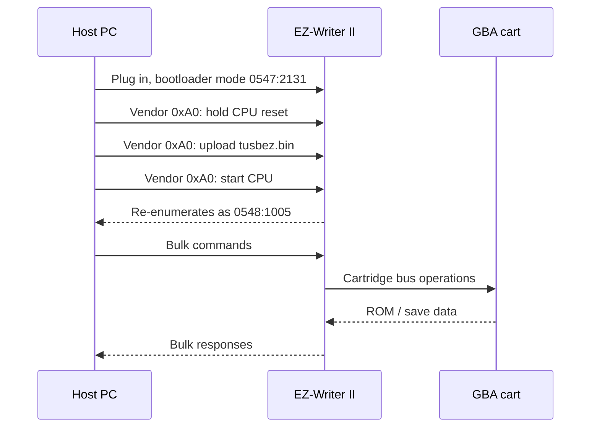

<div align="center">

# EZ-Flash II USB Flasher

Use the EZ-Writer II / EZ-Flash II USB cartridge flasher on a modern PC.

Back up Game Boy Advance ROMs and save files, and restore saves, from Windows,
Linux, or macOS. No old Windows XP driver needed.

[](LICENSE)
[](https://www.rust-lang.org/)
[]()

</div>

---

## Quick start

1. Go to **[Releases](https://github.com/YoshKoz/ez-flash-ii-usb-flasher/releases/latest)**.
2. Download the app for your OS, plus **all** the `.bin` firmware files.
3. Put everything in **one folder**.
4. **Windows only:** install the WinUSB driver with
   [Zadig](https://zadig.akeo.ie/) — see [Windows setup](#windows-setup).
5. Plug in the writer, then open `ezwriter-gui` (double-click the app).

That is the whole setup for a normal backup. The rest of this page is detail.

> Just want to back up a game? In the GUI: **Status → Detect**, then
> **Cart Info**, then use **Read ROM** and **Read Save**. Done.

## What you can do

| Task | Where | Safe? |
|------|-------|-------|
| Find the writer | Status tab / `list` | Yes |
| Load firmware onto the writer | Status tab / `firmware-download` | Yes |
| Read cartridge info | Cart Info tab / `cart-info` | Yes |
| Back up a ROM | Read ROM tab / `dump` | Yes |
| Back up a save | Read Save tab / `save-read` | Yes |
| Restore a save | Write Save tab / `save-write` | Be careful |
| Write a ROM / erase | CLI only (`write-rom`, `erase`) | Experimental, can brick the cart |

Read-only tasks (everything except writing) are the safe, supported path.
If you only want backups, you never need the risky commands.

## Windows setup

Linux and macOS need no driver (macOS may ask for USB permission; Linux may need
a udev rule or root).

On Windows, install WinUSB once with [Zadig](https://zadig.akeo.ie/):

1. Run Zadig as Administrator.
2. `Options → List All Devices`.
3. Select `EZ-Writer II`.
4. Choose `WinUSB`, then click `Install Driver`.

The writer shows up **twice**, because it changes ID after the firmware loads
(`0547:2131` → `0548:1005`). If it is still unknown after you load firmware,
run Zadig again and bind WinUSB to the second entry too. It may be named
`EZ-Writer Fujitsu` — that is normal.

## The GUI

Five tabs along the top, used left to right:

| Tab | What it does |
|-----|--------------|
| **Status** | Find the writer and load its firmware |
| **Cart Info** | Show the game title, code, save type, and ROM size |
| **Read ROM** | Save the cartridge ROM to a `.gba` file |
| **Read Save** | Save the cartridge save data to a `.sav` file |
| **Write Save** | Put a `.sav` file back onto the cartridge |

## Command line

Same features, for scripting. Build first:

```console
cargo build --release -p ezwriter-cli -p ezwriter-gui
```

The `.bin` firmware files live in [`firmware/`](firmware/) — copy them next to
the built program in `target/release/` before running it.

Then, from that folder:

```console
./ezwriter-cli list                       # 1. find the writer
./ezwriter-cli firmware-download tusbez.bin   # 2. load firmware (if asked)
./ezwriter-cli cart-info                  # 3. read the cartridge
./ezwriter-cli dump mygame.gba            # 4. back up the ROM
./ezwriter-cli save-read 0 2048 --output mygame.sav   # 5. back up the save
```

On Windows, write `.\ezwriter-cli.exe` instead of `./ezwriter-cli`.

The firmware is loaded into the writer's RAM; unplugging clears it, so it must
be loaded again on every new connection.

### How the backup commands protect you

- `dump` works out the cartridge size by itself, reads every block twice and
  compares them, and only renames `mygame.gba.partial` to `mygame.gba` when the
  whole file is complete and matches. A bad dump fails instead of saving a
  fake-good file. `--verify` adds one more full pass.
- A Gen 3 `.sav` is only accepted if it is 131072 bytes with at least 14 section
  signatures, so a broken save is not silently written.
- `--no-confirm` and `--fast` are faster but skip the double read. Use only if
  you understand the risk.

### Speed

A 16 MB ROM takes about 23 minutes today (46 with verification), because each
64-byte block costs a USB round trip plus a 5 ms delay. The hardware could do it
in ~14 seconds. See [docs/dump_performance.md](docs/dump_performance.md) for why,
and for the `bench` command that measures it on your unit.

## Troubleshooting

| Symptom | Likely cause | What to do |
|---|---|---|
| `loader_table1.bin` / `loader_table2.bin` missing | Old or wrong firmware files | Download the `.bin` files from [Releases](https://github.com/YoshKoz/ez-flash-ii-usb-flasher/releases/latest) and keep them beside the app |
| Writer shows as "unknown" in Zadig | That is the bootloader, before firmware loads | Bind WinUSB anyway, then load the firmware |
| Writer LED stays red, "no cartridge detected" | Dead save battery in the cartridge | Try a cartridge with a good battery; a dead battery does not block ROM backups |
| WinUSB install seems to do nothing on a second run | It was already applied | Re-run Zadig, `List All Devices`, confirm both IDs show WinUSB |
| One cartridge backs up corrupt, another is fine | The cartridge, not the writer | Run `dump --verify` twice. Results that differ = unstable cartridge. Same-but-wrong = bootleg/repro cart |
| `save-id` shows no change | Save chip is not JEDEC-readable | Typical of bootleg/repro PCBs; their saves cannot be dumped reliably |
| "unrecognised save type" | Game code is not in the built-in list | On purpose — guessing can lock the cart until you replug. Run `save-id`, then `save-read -t f\|s\|e --output <file>` |

## Safety

- **Back up the ROM and the save before writing anything.**
- Use a short, good USB cable. Do not use a hub.
- Do not unplug or interrupt a write.
- Treat `write-rom` and `erase` as experimental — they can brick the cartridge.

Full checklist: [SAFETY.md](SAFETY.md).

## How it works

The writer starts as a Cypress AN2131Q (8051) chip in bootloader mode. The app
uploads the vendor firmware (`tusbez.bin`) into its RAM over USB, the chip
restarts and re-appears with a new ID, and then the app talks to the cartridge
through it.




Full protocol notes: [docs/protocol_notes.md](docs/protocol_notes.md).

## Project layout

```text
.
|-- src/ezwriter-cli/       Command-line tool
|-- src/ezwriter-gui/       Desktop app
|-- firmware/               AN2131 firmware + loader tables
|-- docs/                   Protocol notes and driver analysis
|-- driver/winusb-inf/      Optional WinUSB INF files
`-- SAFETY.md               Write-operation safety guide
```

> Originally created as `ezwriter-reverse` during reverse engineering.
> The programs keep the `ezwriter-` prefix — the hardware is commonly called
> EZ-Writer II.

## Legal

Use this for homebrew, preservation, personal backups, saves from cartridges you
own, and GBA development. Do not use it for piracy.

## References

- [libusb](https://libusb.info/)
- [WinUSB](https://learn.microsoft.com/en-us/windows-hardware/drivers/usbcon/introduction-to-winusb-for-developers)
- [Zadig](https://zadig.akeo.ie/)
- [egui](https://github.com/emilk/egui)
- [Cypress EZ-USB AN2131 TRM](https://www.infineon.com/assets/row/public/documents/24/44/infineon-an2131-trm-usermanual-en.pdf)